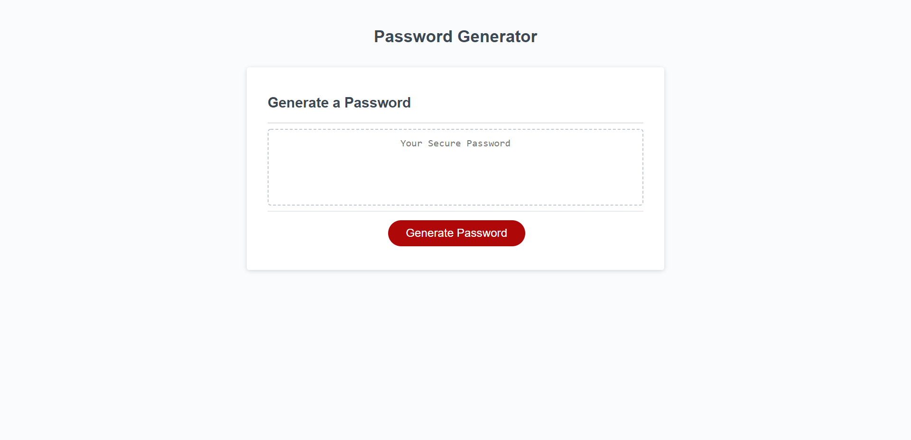
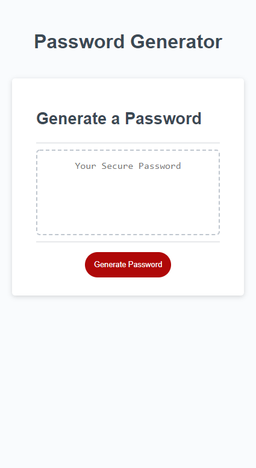
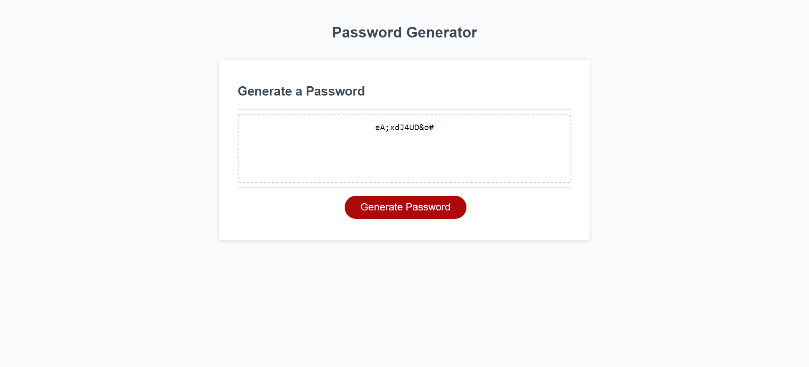

# Custom Password Generator

This project generates a custom password based on criteria chosen by the user after they are guided through a series of pop-up boxes.

## User Story

```
AS A user who needs to create a password for a login
I WANT to generate a random password with different character types and numbers
SO THAT I can have a more secure password to be used for my account
```
## Usage

Click the "Generate Password" button to begin a series of pop-up boxes that has you select the criteria necessary for your generated password.

When prompted with the password length, enter a number between 8 and 128 to set the password length to that number.

Then choose which character types to include by clicking OK for Yes or Cancel for No on each pop-up box.

Afterwards the password has been generated using your selected criteria and is outputted to the text area. You can now freely copy or write down your password to be used.

Select the "Generate Password" button again to make a new password.


## Images

### Desktop View



### Mobile View



### Example of a Generated Password



## GitHub Links

### [Repository](https://github.com/PierTwo/custom-password-generator)

### [Deployed application](https://piertwo.github.io/custom-password-generator/)

